# Windows Server Active Directory Homelab

## Overview
This project documents the creation of a Windows Server 2022 Active Directory homelab environment built using VirtualBox.

The purpose of the lab was to develop hands-on infrastructure, networking and systems administration skills commonly used in enterprise IT environments.

---

## Technologies Used
- VirtualBox
- Windows Server 2022
- Windows 11 Pro
- Active Directory Domain Services
- DNS
- Group Policy
- Virtual Networking
- Jira

---

## Lab Configuration

### Domain Controller
- Hostname: DC01
- Domain: homelab.local
- Services:
  - Active Directory
  - DNS

### Client Machine
- Windows 11 Pro
- Joined to Active Directory domain

### Network Configuration
- Internal VirtualBox network
- Static IP addressing

### Server IP
192.168.100.1

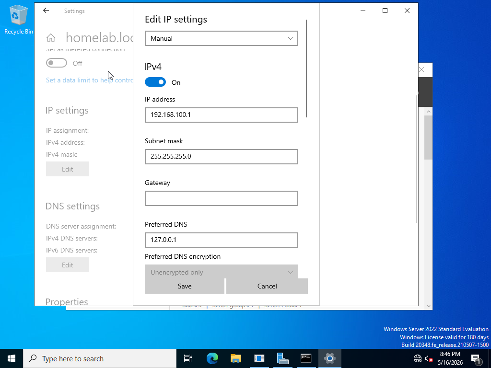

### Client IP
192.168.100.10

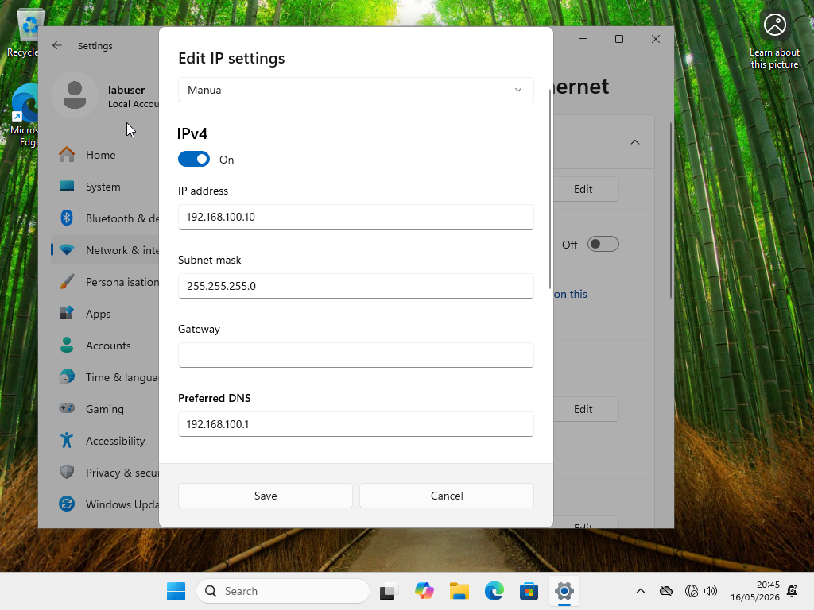

### Connectivity Test

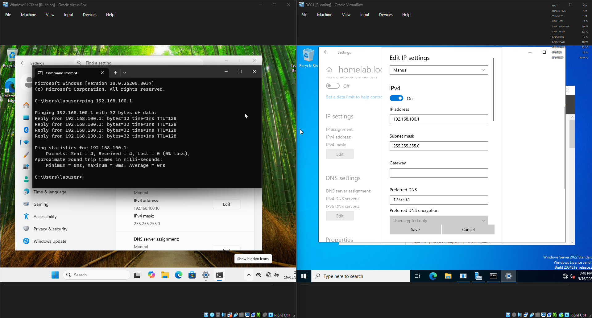

---

## Features Implemented

### Active Directory Domain Setup

### Organisational Units (HR, IT, Sales)

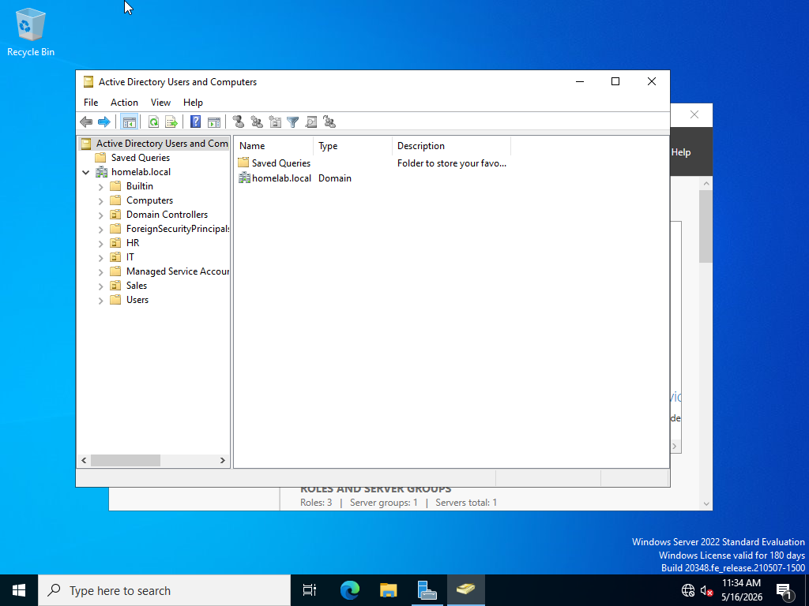

### User Account Creation

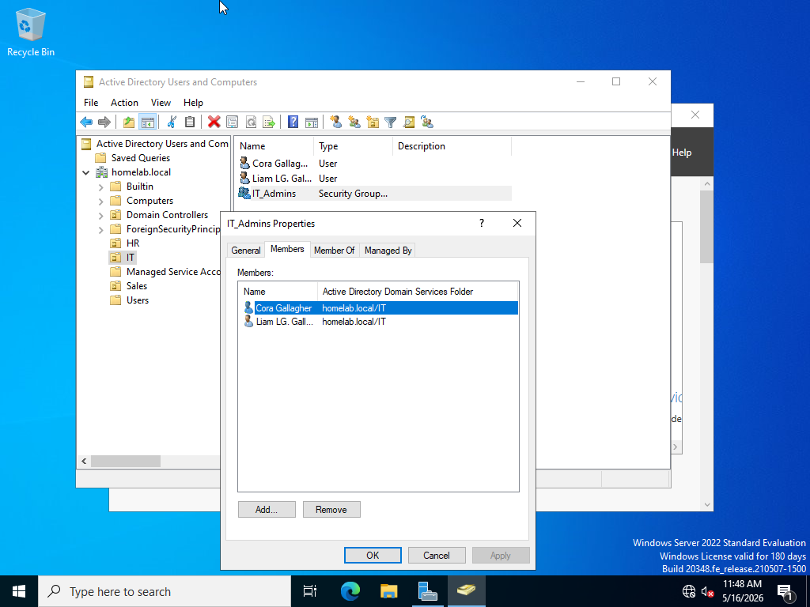

### Security Groups

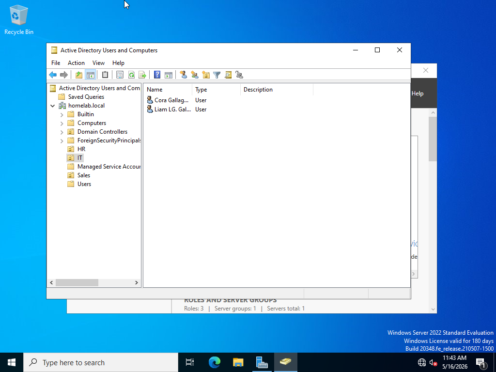

### Windows Client Domain Join

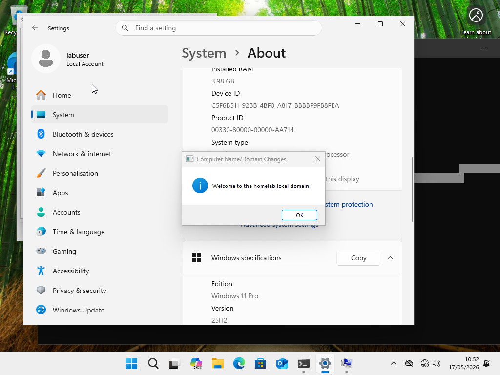

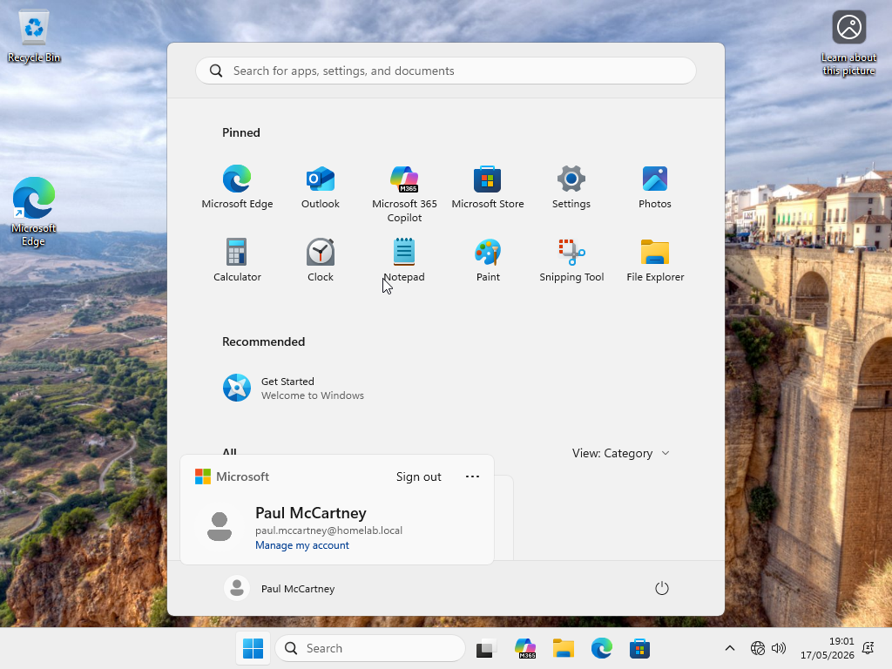

---

## Group Policy Configuration

### Company Wallpaper Policy
Configured a Group Policy Object (GPO) to automatically deploy a desktop wallpaper to domain users.

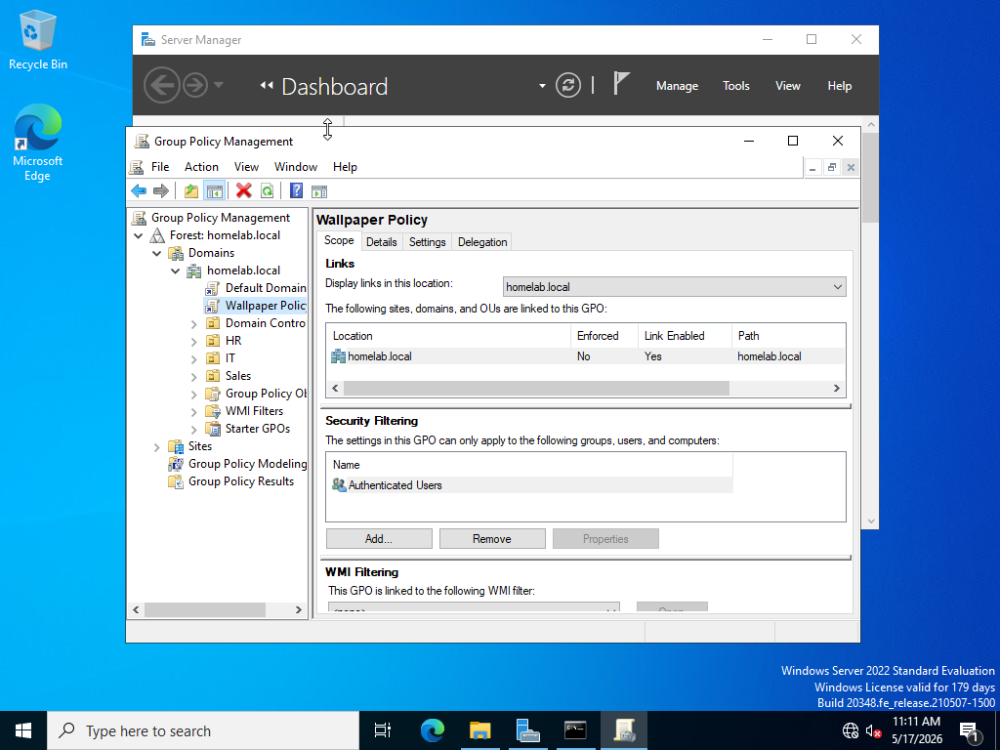

### Disable Control Panel Policy
Configured a Group Policy Object to restrict access to Control Panel and Windows Settings.

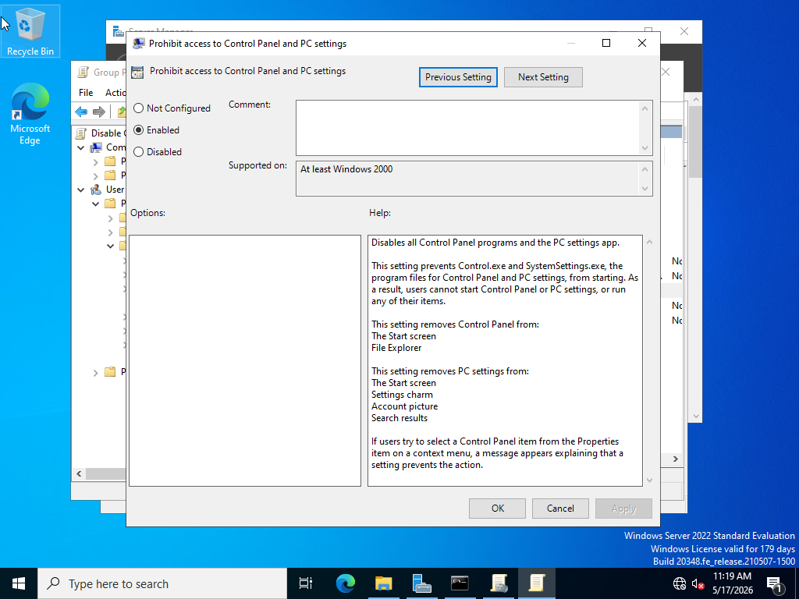

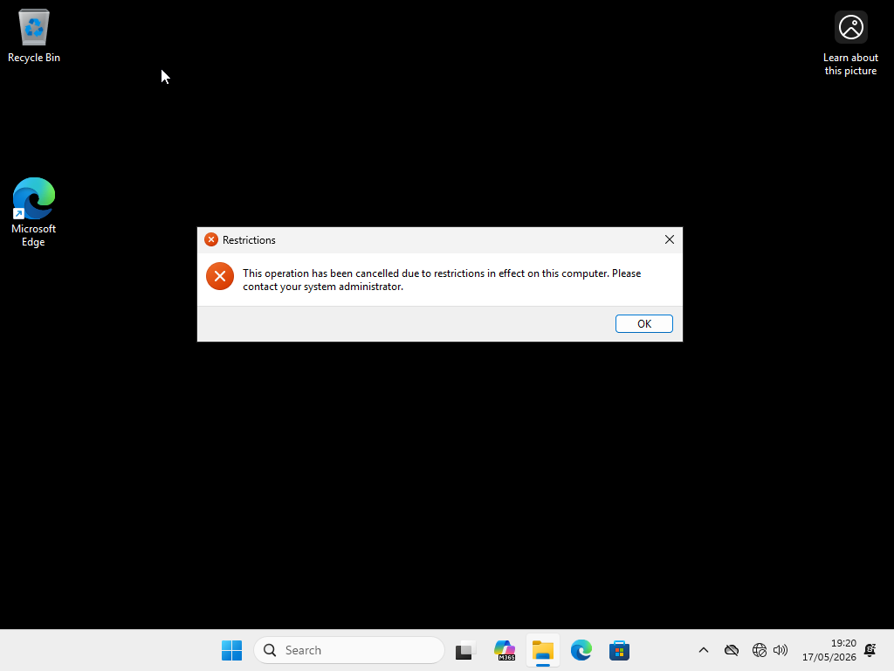

---

## Troubleshooting & Issues Encountered

### Domain Controller Promotion Failure

#### Issue
Prerequisite checks failed due to pending hostname change requiring reboot.

#### Resolution
Restarted the server VM and reran the Domain Controller promotion process successfully.

---

### Windows 11 Home Limitation

#### Issue
Windows 11 Home edition could not join the Active Directory domain.

#### Resolution
Reinstalled client VM using Windows 11 Pro edition.

---

### VM Networking Issues

#### Issue
Client machine could not communicate with Domain Controller.

#### Resolution
Configured both VMs on the same Internal Network in VirtualBox and assigned static IP addresses.

---

### Windows 11 Microsoft Account Requirement

#### Issue
Windows 11 setup required internet and Microsoft account sign-in.

#### Resolution
Used OOBE bypass methods to complete offline local account setup.

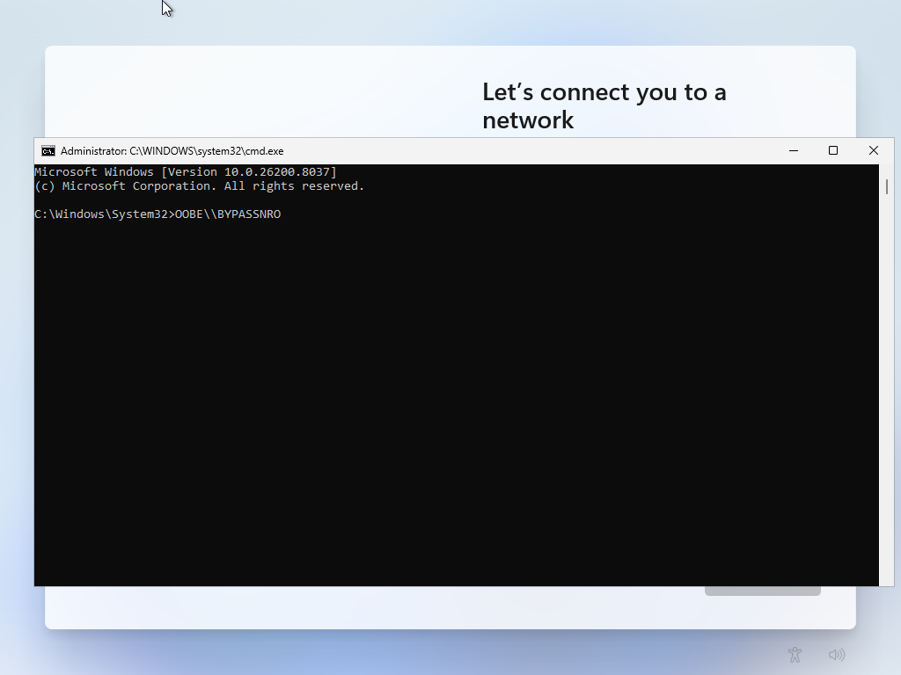

---

## Jira IT Support Workflow Simulation

Used Jira Service Management to simulate IT support workflows and issue tracking for the Active Directory homelab environment.

Created and managed tickets related to:
- Active Directory deployment
- DNS troubleshooting
- Group Policy issues
- Domain join failures
- Virtual network connectivity

Practised ticket lifecycle management using:
- To Do
- In Progress
- Done

Included troubleshooting notes, priorities, and documented resolutions to simulate real-world IT support operations.

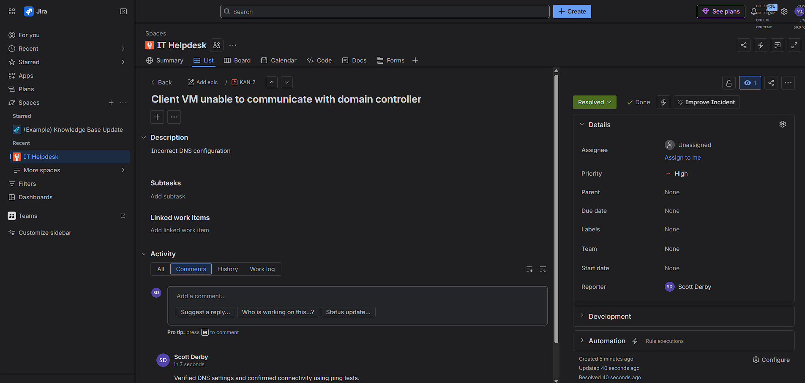

---

## Skills Developed
- Windows Server administration
- Active Directory management
- DNS configuration
- Virtualisation
- Networking fundamentals
- Group Policy administration
- Troubleshooting and problem solving
- Infrastructure documentation
